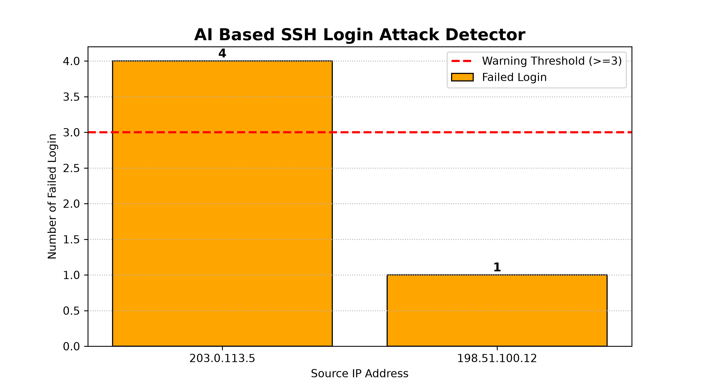

# AI Based SSH Login Attack Detector

## Course Information

- Course: OSG203 - Operating System
- Project: AI Based SSH Login Attack Detector
- Group: 9

## Group Members

- Nguyễn Thế Thọ
- Lã Ngọc Ninh

---

## Project Description

This project analyzes Linux SSH authentication logs and detects abnormal login attempts using a simple anomaly detection approach.

The program:

- Reads SSH authentication logs.
- Extracts failed login IP addresses.
- Counts failed login attempts.
- Detects suspicious IPs (>=3 failed logins).
- Exports the analysis result to CSV.
- Generates a visualization chart.

---

## Technologies

- Python 3
- Regular Expression (Regex)
- Collections.Counter
- Matplotlib

---

## Project Structure

```
SSH_Login_Detector
│
├── auth_log.txt
├── collect_log.sh
├── main.py
├── requirements.txt
├── README.md
├── result.csv
└── bieu_do_output.png
```

---

## Dataset

The project uses a simulated Linux SSH authentication log stored in:

```
auth_log.txt
```

---

## How to Run

Install dependencies:

```
pip install -r requirements.txt
```

Run the program:

```
python main.py
```

---

## Output

The program generates:

- result.csv
- bieu_do_output.png

---

## Sample Result

The detector identifies:

| IP Address | Failed Login | Status |
|------------|-------------:|--------|
|203.0.113.5|4|Warning|
|198.51.100.12|1|Normal|

---

## GitHub Repository

Source code for OSG203 Group Project.
## Result

Below is the generated chart after analyzing the SSH authentication log.


